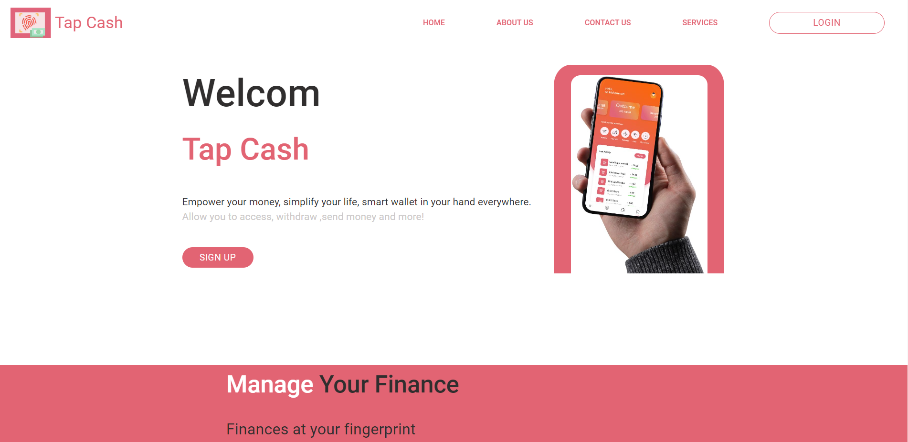
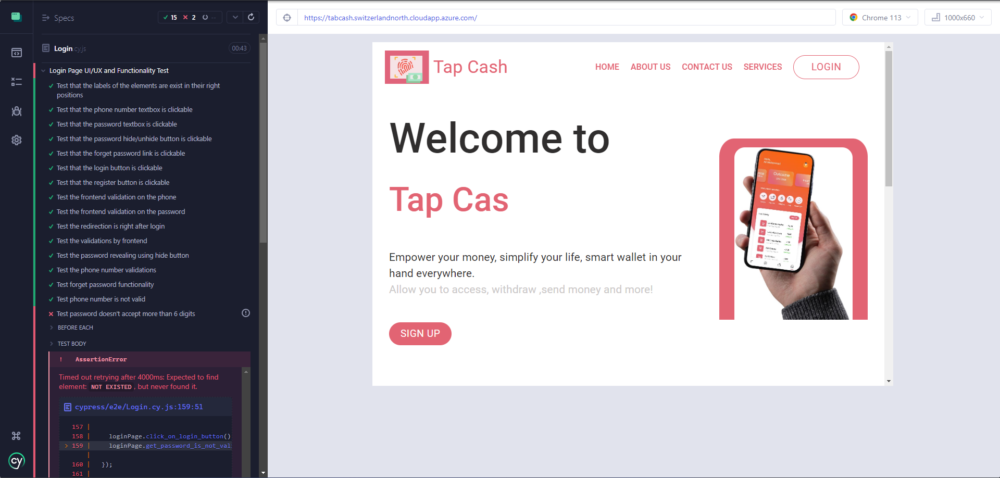
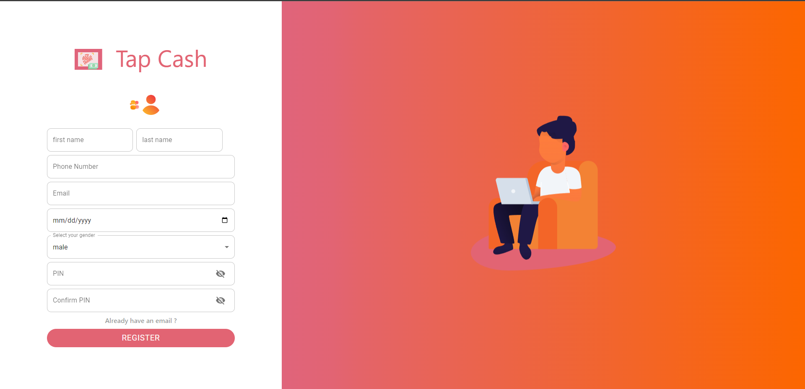
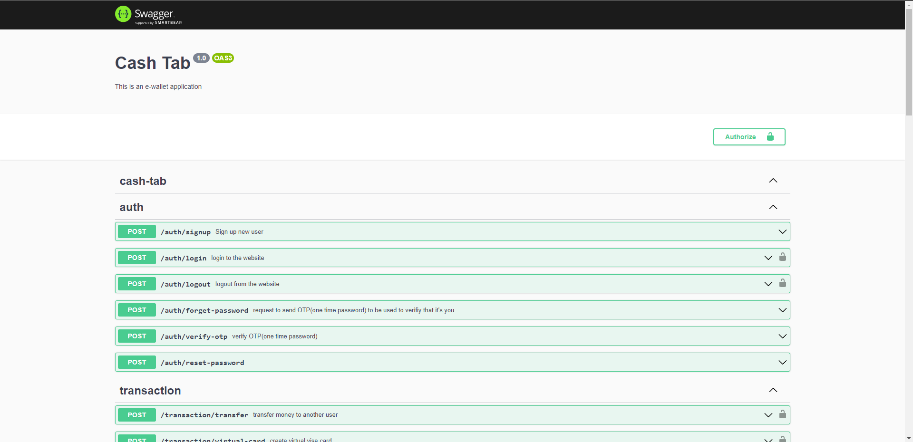
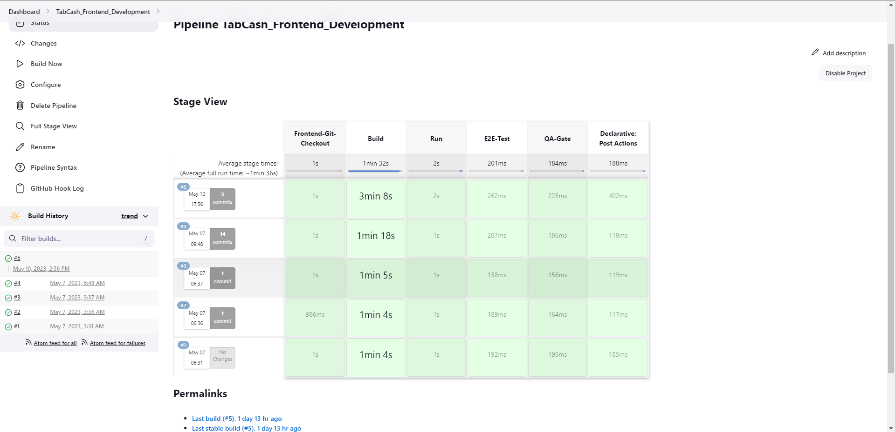
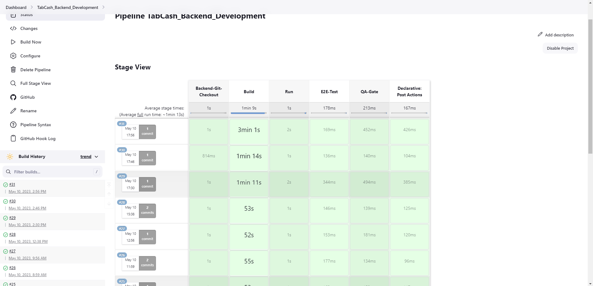

# DevOps Repository

Welcome to my DevOps repository! This repository contains all the Dockerfiles, docker-compose files, and Jenkinsfiles that I have used to deploy our application TapCash (E-Wallet) for ODC EID Hackathon. Additionally, it contains screenshots of the application, including the landing page, login page, signup page, Swagger APIs, and Jenkins pipelines.

## Screenshots

Here are some of the screenshots of the application and Jenkins pipelines that I have worked on:

### Landing Page

### Login Page

### Login Page Testing

### Signup Page

### Swagger APIs

### Jenkins Pipelines

### Frontend Pipeline

### Backend Pipeline

## Dockerfiles

This directory contains all the Dockerfiles that I have used to create the images of the frontend and backend servers.

## Docker-compose Files

This directory contains all the docker-compose files that I have used to run the containers of the frontend and backend servers.

## Jenkinsfiles

This directory contains all the Jenkinsfiles that I have used to create the Jenkins pipelines for building, testing, and deploying the frontend and backend servers.

Thank you for visiting my repository! Please feel free to explore the files and use them as a reference for your DevOps projects.
